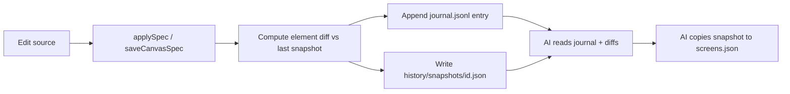

# AI-Readable Design History System

## Problem today

Your current safety net has three layers, all inadequate for "find the version before the AI broke my buttons":

| Layer | Where | Limitation |
|-------|-------|------------|
| Session undo | [`useSpecHistory.ts`](School Scrips/Math App Studio/renderer/src/app/hooks/useSpecHistory.ts) | In-memory only, 80 whole-spec steps, lost on restart |
| Rolling backups | [`canvas-spec.js`](School Scrips/Math App Studio/electron/canvas-spec.js) `backupPrototype` | **Last 10 files only**, no element detail, no source tags |
| Pre-AI archives | `backups/screens-pre-ai-*.json` | Same folder as autosaves — **gets pruned**; no diff metadata |

When bad data was written (repair-on-load, AI edit, Studio autosave), there was no journal saying *what* changed, *which elements*, or *why* — so even restoring `screens-2026-07-11T23-14-22-820Z.json` may not be your true layout (it was already post-incident).

You confirmed: **no restore UI for you** — the consumer is the AI, which must read a timeline and pick the right snapshot.



---

## Target layout (per app design folder)

Under `{app}/src/design/`:

```
history/
  journal.jsonl          # append-only timeline (one JSON object per line)
  snapshots/
    2026-07-11T23-14-22-abc1.json   # full screens.json at that moment
    ...
  pinned/                # never auto-deleted (pre-ai, pre-repair, ai-restore)
```

**Journal entry shape** (AI-readable, grep-friendly):

```json
{
  "id": "2026-07-11T23-14-22-abc1",
  "at": "2026-07-11T23:14:22.820Z",
  "source": "studio-autosave | ai-edit | repair-on-load | migration | external-reload | ai-restore",
  "parentId": "previous-snapshot-id or null",
  "activeScreenId": "screen-1783803390569-790",
  "summary": "2 buttons: rectPct changed; buttonLinkGroups removed",
  "changed": {
    "screens": [],
    "buttons": ["button-1783807102883-852"],
    "infoBlocks": [],
    "modals": [],
    "buttonArrays": [],
    "buttonLinkGroups": true
  },
  "diff": { /* compact per-element before/after for changed ids only */ },
  "snapshot": "history/snapshots/2026-07-11T23-14-22-abc1.json",
  "tags": ["pre-ai", "gcf-tutorial"]
}
```

This gives AI exactly what you described: *"it's this step"* — searchable by time, source, element id, or tag.

---

## Phase 1 — Core journal + snapshots (implement first)

### 1. New module: `electron/design-history.js`

Responsibilities:
- `recordDesignChange(cwd, { spec, source, tags, parentSpec })` — diff, write snapshot, append journal line
- `listDesignHistory(cwd, { limit, since, elementId, source, tag })` — for AI/scripts
- `restoreDesignSnapshot(cwd, snapshotId)` — copy snapshot → `screens.json`, log `source: ai-restore`
- Retention: prune `snapshots/` older than **90 days** or over **500 files**, **never** delete `pinned/` or entries with protected tags

### 2. Spec diff utility: `renderer/src/utils/specDiff.ts` (or shared in electron)

Compare two `BlankCanvasSpec` objects and return:
- Added/removed/changed element ids per type (`buttons`, `infoBlocks`, `modals`, `textBlocks`, `buttonArrays`, `widgets`)
- For changed elements: which fields moved (`rectPct`, `linkGroupId`, `buttonLinkGroups`, `fontSizePx`, etc.)
- One-line `summary` string for the journal

Exemplar logic: index elements by `id`, deep-compare only known canvas fields (not full JSON diff — keeps journal small and element-focused).

### 3. Hook save path — [`canvas-spec.js`](School Scrips/Math App Studio/electron/canvas-spec.js)

In `saveCanvasSpec`, after `backupPrototype` (keep as fast safety net), call `recordDesignChange` with:
- `source: opts.source ?? 'studio-autosave'`
- `parentSpec`: previous file contents read before write
- `tags`: from opts (e.g. `pre-ai`)

Pass `source` from renderer via existing IPC save bridge ([`useBlankCanvasCore.ts`](School Scrips/Math App Studio/renderer/src/app/hooks/useBlankCanvasCore.ts)):
- Normal edits → `studio-autosave`
- Undo/redo → `studio-undo` / `studio-redo`
- External reload → no write (already skipped by mtime guard)

### 4. Hook dangerous mutations

| Trigger | Action |
|---------|--------|
| `migrateSpec` / `repairBlankCanvasSpec` on load | **Pinned snapshot + journal** `source: repair-on-load` *before* mutating |
| AI about to edit `screens.json` | Rule-enforced `pinned` snapshot `tags: [pre-ai]` (wire unused [`archiveBlankCanvas`](School Scrips/Math App Studio/renderer/src/app/services/studioApi.ts) IPC or PowerShell script into same journal format) |
| AI restore | `restoreDesignSnapshot` + journal `source: ai-restore` |

### 5. AI protocol doc — `School Scrips/Math App Studio/docs/DESIGN_HISTORY.md`

Short playbook for agents:
1. Read `history/journal.jsonl` (tail 50) when user says layout is wrong
2. Filter by `changed.buttons` / `source: repair-on-load` / time range
3. Open parent snapshot vs current `diff` to confirm
4. Restore with script; **never** hand-edit rects without a pinned checkpoint first

Update [`studio-design-propagation.mdc`](School Scrips/Math App Studio/.cursor/rules/studio-design-propagation.mdc) to require journal consult before any `screens.json` restore.

### 6. Helper scripts (AI-invoked, not UI)

- [`scripts/list-design-history.ps1`](School Scrips/Math App Studio/scripts/list-design-history.ps1) — table of recent entries (id, time, source, summary, changed ids)
- [`scripts/restore-design-snapshot.ps1`](School Scrips/Math App Studio/scripts/restore-design-snapshot.ps1) — restore by id + append journal entry

---

## Phase 2 — Richer element accounting (after Phase 1 works)

- **Stable element fingerprints** in journal: `button-1783807102883-852` + `infoBlockId` + `linkGroupId` so AI can trace a button across renames
- **Checkpoint tags** AI can set in conversation: `tag-checkpoint gcf-buttons-good` → pinned snapshot
- **IPC `listDesignHistory`** exposed in `studioApi` so agents in Studio context can query without shell
- Migrate legacy `backups/screens-*.json` into `history/snapshots/` with synthetic journal entries (one-time import script for Solving Quadratics)

---

## Phase 3 — Optional later (only if needed)

- Per-element history drill-down (all versions of one button id) — derived from journal, no separate store
- Instruction-pins journal (same pattern, separate `history/pins-journal.jsonl`)
- User-visible timeline UI — **explicitly out of scope** per your preference

---

## Immediate recovery note (this session)

Phase 1 does not retroactively create history for edits already lost. For **right now**:
- AI should scan **all** files in [`Solving Quadratics App/src/design/backups/`](School Scrips/Solving Quadratics App/src/design/backups/) **and** [`backups/screens-pre-ai-2026-07-11T17-30-58.json`](School Scrips/Solving Quadratics App/src/design/backups/screens-pre-ai-2026-07-11T17-30-58.json) (earlier than tonight's incident)
- Diff each candidate against current `screens.json` focusing on GCF `button-*` rects + `buttonLinkGroups`
- Pick best match by element ids + your described layout (8×6, linked groups), not by "most recent backup"

Once Phase 1 ships, that manual archaeology becomes: `list-design-history.ps1 -ElementId button-1783807102883-852`.

---

## Files to create/change (Phase 1)

| File | Change |
|------|--------|
| `electron/design-history.js` | **New** — journal, snapshots, retention, restore |
| `electron/canvas-spec.js` | Call design-history on save/load repair |
| `electron/main.js` | IPC handlers: `listDesignHistory`, `restoreDesignSnapshot` |
| `renderer/src/utils/specDiff.ts` | **New** — element-level diff |
| `renderer/src/app/hooks/useBlankCanvasCore.ts` | Pass `source` on save |
| `scripts/list-design-history.ps1` | **New** |
| `scripts/restore-design-snapshot.ps1` | **New** |
| `docs/DESIGN_HISTORY.md` | **New** — AI playbook |
| `.cursor/rules/studio-design-propagation.mdc` | Require journal + pinned checkpoint before AI edits/restores |

---

## What this prevents

- AI (or repair code) silently resizing buttons → journal shows `source: repair-on-load`, `changed.buttons`, exact `rectPct` delta
- "Restored backup wasn't right" → AI can walk **parent chain** in journal to earlier snapshots, not guess from 10 rolling files
- Studio autosave overwriting good state → every save is a labeled step AI can bisect

## What this does not do

- Replace git (still useful for code); history is **design-spec-specific** and element-granular
- Guarantee recovery of edits never saved (crash within 400ms debounce) — mitigated by journaling on save + expanding snapshot count
