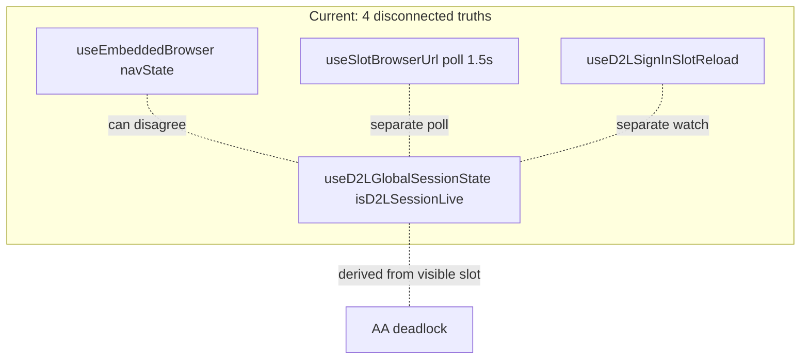

# Macro App: structural consolidation plan

Goal: make bugs like the Assignment Assistant deadlock structurally impossible by removing parallel/duplicate implementations of shared concepts, ordered lowest-risk-first. This is a refactor-for-stability plan, not a feature plan. Behavior should be preserved at every phase (follow `cursor-patterns/refactoring-checklist.md`).

## Root-cause thesis

The codebase isn't bloated so much as it has accreted multiple partial implementations of the same concept, with no single owner. Every duplicate is a place where "the truth" can disagree with itself, which surfaces as races/deadlocks. Evidence found:

- 58 hooks in `renderer/src/hooks/`, plus 21 Electron modules.
- Dead code presented as authoritative.
- Four overlapping trackers of "session live / slot URL".
- Two ~1,000+ line god-files.
- ~10 scroll-related hooks.

## Phase 0 - Baseline and safety (no code change)
- Confirm green build (`npm run build` in `renderer/`) and a working manual smoke path: sign in, open Browser/Gradebook/Assignment Assistant tabs.
- Produce a one-screen inventory: every hook + one-line purpose, flag suspected duplicates. This is the artifact to diff against Claude's plan.

## Phase 1 - Delete confirmed dead code (lowest risk, highest clarity-per-effort)
- Remove [School Scrips/Macro App/renderer/src/hooks/useBrowserSlotWarmup.ts](School Scrips/Macro App/renderer/src/hooks/useBrowserSlotWarmup.ts). It is 306 lines and imported by nothing (grep returns only the file itself). The live warmup path is [useBackgroundGradebookSlotLoader.ts](School Scrips/Macro App/renderer/src/hooks/useBackgroundGradebookSlotLoader.ts) via [useGradebookShellIntegration.ts](School Scrips/Macro App/renderer/src/hooks/useGradebookShellIntegration.ts).
- Sweep for other zero-import modules and remove them. Each deletion makes future AI sessions reason about the real system, not a ghost.

## Phase 2 - One source of truth for D2L session + slot URLs (the core fix)
Today four hooks each hold a slightly different version of "what URL / am I signed in", wired together in [useMacroAppShell.ts](School Scrips/Macro App/renderer/src/hooks/useMacroAppShell.ts) (lines ~87, ~171, ~326):
- [useEmbeddedBrowser.ts](School Scrips/Macro App/renderer/src/hooks/useEmbeddedBrowser.ts) - active slot nav state (event-driven)
- [useD2LGlobalSessionState.ts](School Scrips/Macro App/renderer/src/hooks/useD2LGlobalSessionState.ts) - `isD2LSessionLive` derived from the visible slot URL (the deadlock source)
- [useSlotBrowserUrl.ts](School Scrips/Macro App/renderer/src/hooks/useSlotBrowserUrl.ts) - polls one slot every 1.5s
- [useD2LSignInSlotReload.ts](School Scrips/Macro App/renderer/src/hooks/useD2LSignInSlotReload.ts) - watches the browser URL for sign-in transitions

Plan: introduce a single slot/session registry that owns per-slot URL + loading + a session-live flag, fed by the existing main-process nav-state events. The four hooks become thin selectors over that one store. Net effect: `isD2LSessionLive` is no longer a function of "whichever slot is visible", so the AA-tab-on-about:blank deadlock cannot recur. Keep the sticky `isD2LSessionKnownLive` we added as the persisted-login signal feeding this store.

Acceptance: opening any tab never flips the global signed-in flag false; remove the per-render guards/refs we added as band-aids once the store makes them unnecessary.

## Phase 3 - Collapse browser-slot orchestration / AA activation paths
There are multiple entry points that activate the AA slot (tab select, a shell priming effect, and the workflow navigation). We already removed one duplicate path this session. Plan: define one orchestrator that owns "make slot X visible at URL Y", and have tab-select + workflow call only that. This pairs naturally with Phase 2's registry.

## Phase 4 - Split the two god-files (after Phase 2/3, not before)
- [useMacroAppShell.ts](School Scrips/Macro App/renderer/src/hooks/useMacroAppShell.ts) is ~1,070 lines and violates the 800-line cap and the App.tsx-orchestrator rule in spirit (logic moved into one hook). Extract cohesive slices (session/slot wiring, gradebook wiring, tab handlers) into focused hooks once Phase 2 has given them a clean state boundary to split along.
- [electron-app/browser-view-slots.js](School Scrips/Macro App/electron-app/browser-view-slots.js) is ~1,100 lines; split slot lifecycle, z-order/attach, auth-redirect, and scroll-script concerns.

## Phase 5 - Scroll hook audit (medium priority)
~10 hooks orbit scrolling: useViewportSmoothScroll, useLocalViewportSmoothScroll, useSmoothPanScroll, useBrowserSmoothScroll, useBrowserScrollSpeed, useGradebookScrollSpeed, useGradebookScrollPaging, useGradebookViewportWheelScroll, useGradebookHoverPage, useGradebookDelayedHover. One read-only pass: classify genuinely-distinct (browser vs grid) vs accidental twins, then merge the twins behind a shared primitive. Do not touch until Phases 1-3 are stable.

## Phase 6 - Guardrail so this does not re-accrete (root-cause fix for the workflow)
- Add an anti-duplication rule to `CLAUDE.md` / user rules: "Before writing new code, search for an existing hook/function/service that does this and extend it. If you are about to create a second implementation of an existing concept, STOP and surface it for a decision." Your current standards cover file size and modals but not duplicate-concept creation, which is the actual failure mode.
- Adopt a periodic "what here is dead?" sweep (the question that surfaced useBrowserSlotWarmup).

## Sequencing rationale
1 (delete dead) -> 2 (one source of truth) -> 3 (one orchestrator) are the high-value, deadlock-killing core. 4/5 (split files, merge scroll hooks) are cleanup that is safer and more obvious once 2/3 land. 6 prevents regression of the whole effort.

## Explicitly out of scope
- Feature changes, UI redesigns, Python/grade-sync logic.
- The D2L-Assignment-Platform variant tree (separate concern).