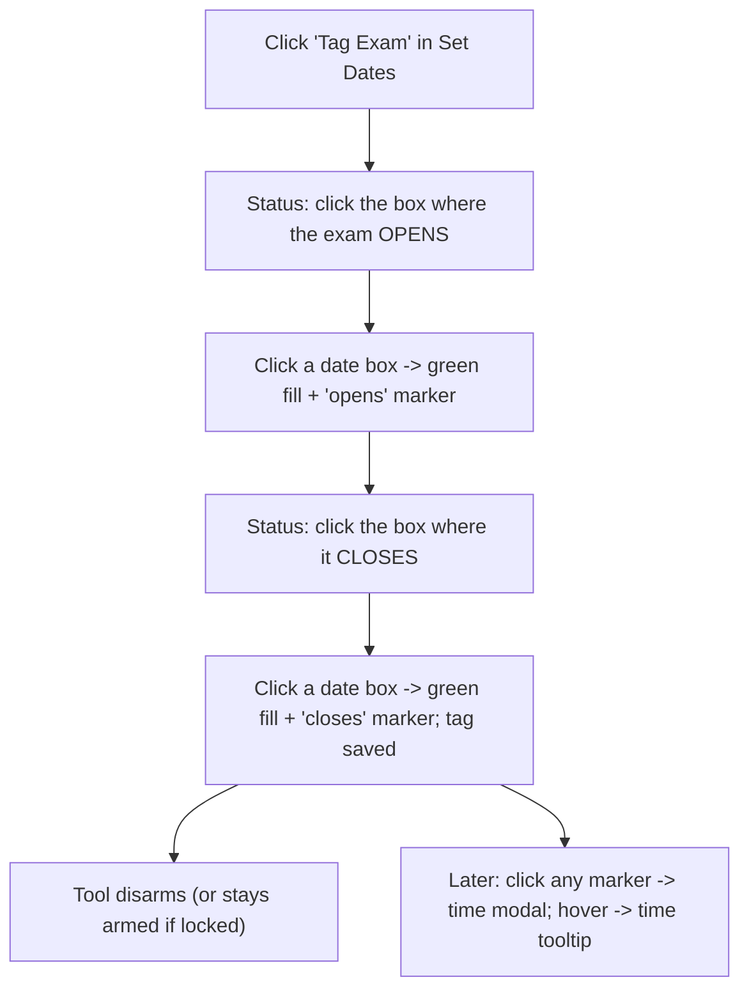

# Online Exam/Quiz Tagging (My Calendar tab)

## Scope and target

- All work is in the **My Calendar** codebase (`my-calendar/src`, alias `@my-calendar`) only. NOT the Calendar tab (`calendar-vendor`). The Pearson macro reads exclusively from My Calendar (`renderer/src/services/pearsonCalendarExams.ts` imports `@my-calendar/*`), so the tags must live here.
- This plan builds: (1) a saved in-person vs online marker per template, (2) the Exam/Quiz "Set Dates" tagging UI + click-to-place flow + colored markers + per-date time modal + hover tooltip, (3) persistence.
- Out of scope (separate future plan, per your instruction): wiring these tags into the Pearson online macro; the 3-column side-panel redesign.

## How it will work (interaction)

- "Tag Quiz" is identical but yellow.
- Numbering (Exam 1, 2, ...) is derived automatically by open-date order; the button is just generic "Exam"/"Quiz" (matches your "for just an exam" correction).

## Data model and persistence

New per-template record, persisted with a dedicated store modeled exactly on the existing important-dates store (`my-calendar/server/backend/services/templateImportantDatesStore.js` + route `/calendar/template-important-dates`, and frontend `saveTemplateImportantDatesByKey`/`loadTemplateImportantDatesByKey` in `my-calendar/src/api/calendarApi.ts:203-233`). A sibling store keeps important-dates clean since modality is template-level and tags are per-sheet with a richer shape:

- New backend store `template-class-tags.json` + endpoints `GET/POST /calendar/template-class-tags` (clone of the important-dates handlers in `my-calendar/server/backend/routes/calendarRoutes.js`).
- New frontend api fns `loadTemplateClassTagsByKey(key)` / `saveTemplateClassTagsByKey(key, data)` in `calendarApi.ts`, keyed via the existing `normalizeTemplateCourseKey`.
- Shape:
  - `modality: 'online' | 'face2face'` (template-level)
  - `bySheet: Record<sheetName, Tag[]>` where `Tag = { id, kind:'exam'|'quiz', openIso, openTime, closeIso, closeTime }` (times default to `'11:59 PM'`, editable later).

## Phase 0 - Make room in the sidebar (file size)

`my-calendar/src/components/templates/TemplateWorkspaceSidebar.tsx` is **718 lines** (over the 700 soft cap). Before adding a section, extract the course-panel portion into sibling files, mirroring the split already done in the Calendar tab (`calendar-vendor/src/components/templates/sidebar/`): `sidebarPrimitives.tsx`, `sidebarTypes.ts`, `TemplateLibrarySidebar.tsx`, `TemplateCoursePanelSidebar.tsx`, thin orchestrator. This is a behavior-preserving move; use the calendar-vendor files as the exemplar.

## Phase 1 - Online/face2face marker

- Add a small control in the course panel (in the course-info card around `TemplateWorkspaceSidebar.tsx:491-500`, or a tiny new "Class type" section): a click toggle "Online" / "In person" (big dwell-friendly target, not a tiny checkbox).
- Wire through new props in `sidebarTypes.ts` and a handler in the workspace that loads/saves `modality` via the new store. Default unknown templates by inferring once with `detectTemplateIsOnline(...)` (`my-calendar/src/components/excel-workspace/convertWizardUtils.ts`) so existing online templates start correct.
- Gate the Phase 2 "Set Dates" section to render only when `modality === 'online'`.

## Phase 2 - "Set Dates" section + click-to-place tools

- Insert a new `TemplateSidebarSection` titled **Set Dates** between "Edit this calendar" (ends `TemplateWorkspaceSidebar.tsx:592`) and "Assignment Templates" (`:594`), with two arm buttons: **Tag Exam** (green) and **Tag Quiz** (yellow), plus a "lock" toggle reusing the existing `transferLockEnabled` pattern.
- Extend the tool state machine in `my-calendar/src/hooks/useCalendarCellEditor.ts`:
  - Add `'exam' | 'quiz'` to `CalendarEditTool` (`:31-40`).
  - Add an arm fn + a two-phase sub-state (`pendingTag: { kind, openIso } | null`) so the first date-box click records open, the second records close and finalizes the tag.
  - Date-box clicks already route through `handleCalendarCellToolClick` when `calendarToolArmed` (SheetGrid `onPointerDown`). Map clicked cell -> date box + ISO via `detectDateBoxesInWorksheet`/`findDateBoxForCell` (`dateBoxLockUtils.ts`) and the cell's `dateBoxIsoDate`.
- Apply colored fills to the whole 4-row box, mirroring `HOLIDAY_DATE_BOX_FILL` / `applyHolidayFillToDateBox` (`my-calendar/src/components/excel-workspace/semesterHolidayPlacement.ts:28-44`): add `EXAM_DATE_BOX_FILL` (green) and `QUIZ_DATE_BOX_FILL` (yellow). Fills are Excel-level so they survive export; structured tags remain the source of truth.

## Phase 3 - In-cell marker, time modal, hover tooltip

- Add per-cell flags to `SheetCellView` in `my-calendar/src/components/excel-workspace/types.ts` (next to `isHolidayDateBox`, `dateBoxIsoDate`): e.g. `examQuizTag?: { kind, role:'open'|'close', time }`. Populate them in `sheetPreviewBuilder.ts` (the holiday-box loop) by reading the loaded tags.
- Render a clickable marker in the box's middle cell, modeled on the in-cell interactive element `AssignmentCalendarDateBox.tsx` (`CalendarTopicsSummaryRow`, `role="button"`) + the delayed/pinned tooltip in `assignmentCalendarHoverContext.tsx`. Hovering shows the time; the cell itself does not display the time text.
- New `ExamQuizTimeModal` built on `ThemedConfirmModal.tsx` / `ModalContainer` (`max-w-md`, no overlay-dismiss). Time picker = a clock dropdown with **common times pinned at top (11:59 PM, 12:00 AM, 6:00 AM)** then 15-minute increments; large click targets, no typing.

## Phase 4 - Load / re-apply / save

- On template open, load tags for the key and re-apply fills + populate preview flags (so markers/colors persist across sessions), analogous to how semester dates are re-applied.
- Persist on every change (arm-place finalize, time set, modality toggle) via the new save fn; reuse the existing `onTemplateEdit`/`templateHasChanges` signal so Save is enabled.

## Key files (My Calendar) and exemplars

- Sidebar: `TemplateWorkspaceSidebar.tsx` (insertion `:592-594`); exemplar split `calendar-vendor/.../templates/sidebar/`.
- Tool machine: `my-calendar/src/hooks/useCalendarCellEditor.ts`.
- Fills: `my-calendar/src/components/excel-workspace/semesterHolidayPlacement.ts`.
- Geometry: `dateBoxLockUtils.ts`; preview flags: `types.ts` + `sheetPreviewBuilder.ts`.
- In-cell marker + tooltip: `AssignmentCalendarDateBox.tsx` + `assignmentCalendarHoverContext.tsx`.
- Modal: `ThemedConfirmModal.tsx`.
- Persistence: `calendarApi.ts:203-233` + `templateImportantDatesStore.js` + `calendarRoutes.js`.
- Existing text detection that this will later replace for Pearson: `my-calendar/src/utils/buildQuizExamDatesTable.ts`.

## Assumptions

- Exam/quiz numbering derived by open-date order (not entered).
- Every tag captures both an open and a close date (two clicks); single-day still works by clicking the same box twice.
- Tags persist in a new sibling store; if you'd rather extend the existing schema-free `template-important-dates` payload instead, that's a small swap.