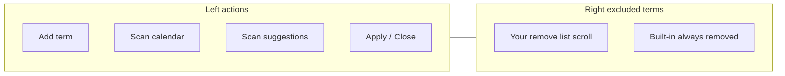

# Remove Terms + Calendar Modal Theme Pass

## Context

Calendar 2.0 runs embedded in Macro App via [`CalendarView.tsx`](c:\Users\chase\Documents\Programs\School Scrips\Macro App\renderer\src\modules\calendar\CalendarView.tsx). Macro’s global styles (`modals.css`, `layout.css`, `shell-tabs.css`) already load in the renderer — Calendar modals currently **ignore** them and use inline styles from [`themedDialogStyles.ts`](c:\Users\chase\Documents\Programs\School Scrips\Calendar 2.0\src\components\excel-workspace\themedDialogStyles.ts).

**Design source of truth:** Macro App modal catalog — launch with `npm run dev:modal-catalog` from Macro App; index at [`MODAL_CATALOG.md`](c:\Users\chase\Documents\Programs\School Scrips\Macro App\docs\MODAL_CATALOG.md).

**Revised approach (per your request):** Model each Calendar modal after a catalog exemplar. Do **not** extend `themedDialogStyles` with new width tokens.

---

## Phase 0 — Cross-package import bridge

Calendar source is compiled inside Macro Vite ([`vite.config.ts`](c:\Users\chase\Documents\Programs\School Scrips\Macro App\renderer\vite.config.ts) `@calendar` alias). Add a second alias so Calendar files can import Macro shell components:

```ts
'@macro': path.resolve(__dirname, 'src'),
```

Example import from Calendar:

```ts
import { ModalContainer } from '@macro/components/ModalContainer';
import { ConfirmModal } from '@macro/components/ConfirmModal';
```

Add calendar-specific layout CSS in [`calendar.css`](c:\Users\chase\Documents\Programs\School Scrips\Macro App\renderer\src\modules\calendar\calendar.css) (reuses `--da-*` tokens already present in Macro host). New classes only where catalog has no exact match — primarily the **two-column Remove Terms grid**.

---

## Phase 1 — Remove Terms redesign (primary feature)

**Catalog exemplar:** Hybrid of:
- [`ClearGradesFolderModal.tsx`](c:\Users\chase\Documents\Programs\School Scrips\Macro App\renderer\src\components\side-panels\ClearGradesFolderModal.tsx) — `courses-modal-overlay`, `clear-courses-panel` width (`min(92vw, 820px)` per [`layout.css`](c:\Users\chase\Documents\Programs\School Scrips\Macro App\renderer\src\styles\layout.css)), `module-help`, `modal-actions d2l-picker-actions`
- [`ManageWorkspaceTabsModal.tsx`](c:\Users\chase\Documents\Programs\School Scrips\Macro App\renderer\src\components\shell\ManageWorkspaceTabsModal.tsx) — `ModalContainer` header, scrollable `__list` / `__row` pattern for dwell-friendly rows
- Catalog ids: `clear-courses-review` + `manage-workspace-tabs`

### Layout



- **Right column:** growing scrollable user terms with large `da-btn` Remove buttons; header count `Your remove list (N)`; below that read-only built-in labels from [`getBuiltinCalendarRemoveTerms()`](c:\Users\chase\Documents\Programs\School Scrips\Calendar 2.0\src\utils\calendarRemoveTermsRegistry.ts) (human labels, not fuzzy keys).
- **Left column:** add-term input + **Scan calendar** (all workbook tabs), suggestions list with Add buttons.

### Scan utility (unchanged logic from prior plan)

New [`scanCalendarRemoveTermCandidates.ts`](c:\Users\chase\Documents\Programs\School Scrips\Calendar 2.0\src\utils\scanCalendarRemoveTermCandidates.ts):
- Loop all worksheets → `parseCalendarWorksheet()` → collect `contentRows` labels
- Filter via exported `isCurriculumCalendarContent()` from [`dateBoxPlacementNormalize.ts`](c:\Users\chase\Documents\Programs\School Scrips\Calendar 2.0\src\utils\dateBoxPlacementNormalize.ts)
- Exclude already-matched built-in + user terms
- Return `{ term, count, sheets }[]` sorted by count desc

Wire `onScanCalendar` from [`ExcelWorkspace.tsx`](c:\Users\chase\Documents\Programs\School Scrips\Calendar 2.0\src\components\ExcelWorkspace.tsx).

Extract `RemoveTermsPanelColumns.tsx` if [`RemoveTermsModal.tsx`](c:\Users\chase\Documents\Programs\School Scrips\Calendar 2.0\src\components\excel-workspace\RemoveTermsModal.tsx) approaches 300 lines.

---

## Phase 2 — Shared prompt shells (high leverage, do first after bridge)

Rewire internals only — **keep existing props/hooks** so behavior is unchanged:

| Calendar component | Catalog exemplar | Shell |
|---|---|---|
| [`ThemedConfirmModal.tsx`](c:\Users\chase\Documents\Programs\School Scrips\Calendar 2.0\src\components\excel-workspace\ThemedConfirmModal.tsx) | `preset-confirm` | `ConfirmModal` + `da-btn--danger` when tone=danger |
| [`ThemedAlertModal.tsx`](c:\Users\chase\Documents\Programs\School Scrips\Calendar 2.0\src\components\excel-workspace\ThemedAlertModal.tsx) | `preset-options` (Done only) | `ConfirmModal` single primary |
| [`ThemedTextPromptModal.tsx`](c:\Users\chase\Documents\Programs\School Scrips\Calendar 2.0\src\components\excel-workspace\ThemedTextPromptModal.tsx) | `preset-options` | `ConfirmModal` + Macro form input classes |

These three cover most confirm/alert flows invoked from hooks across the workspace.

---

## Phase 3 — ExcelWorkspace modal theme audit (all modals in Macro embed)

Every modal rendered from [`ExcelWorkspace.tsx`](c:\Users\chase\Documents\Programs\School Scrips\Calendar 2.0\src\components\ExcelWorkspace.tsx) gets migrated off `themedDialogStyles` inline styles to catalog-matched Macro shells:

| Modal | Catalog exemplar | Width bucket |
|---|---|---|
| RemoveTermsModal | clear-courses + manage-workspace-tabs | wide-820 |
| ThemedConfirm / Alert / TextPrompt | ConfirmModal presets | narrow-448 |
| [`DisplayScaleModal.tsx`](c:\Users\chase\Documents\Programs\School Scrips\Calendar 2.0\src\components\excel-workspace\DisplayScaleModal.tsx) | `preset-settings` | narrow-448 |
| [`UnsavedTemplateExitModal.tsx`](c:\Users\chase\Documents\Programs\School Scrips\Calendar 2.0\src\components\excel-workspace\UnsavedTemplateExitModal.tsx) | `preset-confirm` | narrow-448 |
| [`SaveTemplateConfirmModal.tsx`](c:\Users\chase\Documents\Programs\School Scrips\Calendar 2.0\src\components\excel-workspace\SaveTemplateConfirmModal.tsx) | `preset-confirm` | narrow-448 |
| [`TemplateImportPromptModal.tsx`](c:\Users\chase\Documents\Programs\School Scrips\Calendar 2.0\src\components\excel-workspace\TemplateImportPromptModal.tsx) | `preset-confirm` | narrow-448 |
| [`TemplateTermSelectionModal.tsx`](c:\Users\chase\Documents\Programs\School Scrips\Calendar 2.0\src\components\excel-workspace\TemplateTermSelectionModal.tsx) | `setup-wizard-picker` (`d2l-picker-tabs`) | wide-820 |
| [`CreateTemplateModal.tsx`](c:\Users\chase\Documents\Programs\School Scrips\Calendar 2.0\src\components\excel-workspace\CreateTemplateModal.tsx) | `setup-wizard-picker` | wide-820 |
| [`AttachAssignmentTemplatesModal.tsx`](c:\Users\chase\Documents\Programs\School Scrips\Calendar 2.0\src\components\excel-workspace\AttachAssignmentTemplatesModal.tsx) | gradebook picker modals (`d2l-picker-modal`) | wide-820 |
| [`UncheckedTabsDispositionModal.tsx`](c:\Users\chase\Documents\Programs\School Scrips\Calendar 2.0\src\components\excel-workspace\UncheckedTabsDispositionModal.tsx) | `preset-confirm` | narrow-448 |
| [`ConvertWizardModal.tsx`](c:\Users\chase\Documents\Programs\School Scrips\Calendar 2.0\src\components\excel-workspace\ConvertWizardModal.tsx) | `clear-courses-review` wizard shell | wide-820 |
| ImportantDates / SemesterImportantDates / SummerDisplayPattern / TemplateRestore / TemplateMerge (exported from ConvertWizardModal) | `setup-wizard-*` steps + `module-help` | wide-820 |

**Migration rules:**
- Replace `THEMED_DIALOG_*_STYLE` divs with `ModalContainer` or `ConfirmModal`
- Buttons → `da-btn da-btn--primary` / `da-btn--secondary` / `da-btn--danger` (min-height 48px already in Macro CSS)
- Help text → `module-help`
- Footer rows → `modal-actions d2l-picker-actions` or `confirm-modal__actions`
- **Styling-only** — no behavior/logic changes; `ConvertWizardModal.tsx` is already ~870 lines so extract new styled sub-sections rather than growing the file

**Deferred (not in Macro embed path):** legacy sidebar modals under `Calendar 2.0/src/components/modals/` — sidebar is hidden in Macro (`calendar.css`). Revisit only if you still run Calendar 2.0 standalone.

---

## Phase 4 — Catalog registration

Add dev-only catalog entries in [`modalCatalogEntriesShell.tsx`](c:\Users\chase\Documents\Programs\School Scrips\Macro App\renderer\src\dev\modal-catalog\modalCatalogEntriesShell.tsx) (or new `modalCatalogEntriesCalendar.tsx`):
- `calendar-remove-terms` — mock two-column panel
- Optionally 2–3 other migrated shapes (convert wizard, important dates) for regression comparison

Run `npm run dev:modal-catalog` to visually verify side-by-side with existing Macro modals.

---

## Phase 5 — Cleanup

When no consumers remain, delete or gut [`themedDialogStyles.ts`](c:\Users\chase\Documents\Programs\School Scrips\Calendar 2.0\src\components\excel-workspace\themedDialogStyles.ts). Grep the Calendar tree to confirm zero imports.

---

## Verification

1. `npm run dev:modal-catalog` — confirm new calendar entries match neighboring exemplars.
2. Macro App → Calendar tab → open each modal type (Remove Terms, Convert wizard, Important dates, confirms, display scale).
3. Remove Terms: two-column layout; scan across multi-tab workbook; suggestions exclude section numbers and Exam/Quiz; Add moves term to right list.
4. Apply to Open Calendar still strips via existing [`stripCalendarRemoveTermsFromWorksheet`](c:\Users\chase\Documents\Programs\School Scrips\Calendar 2.0\src\utils\stripCalendarRemoveTerms.ts).
5. Accessibility: all action buttons ≥48px; no overlay-click dismiss (ModalContainer constraint).

---

## Implementation order

1. `@macro` alias + calendar-modals.css scaffolding
2. ThemedConfirm / Alert / TextPrompt → ConfirmModal (quick visual win across app)
3. Remove Terms feature + Macro theme (two-column + scan)
4. Remaining ExcelWorkspace modals in table order (smallest confirms first, ConvertWizard last)
5. Catalog entries + themedDialogStyles cleanup
