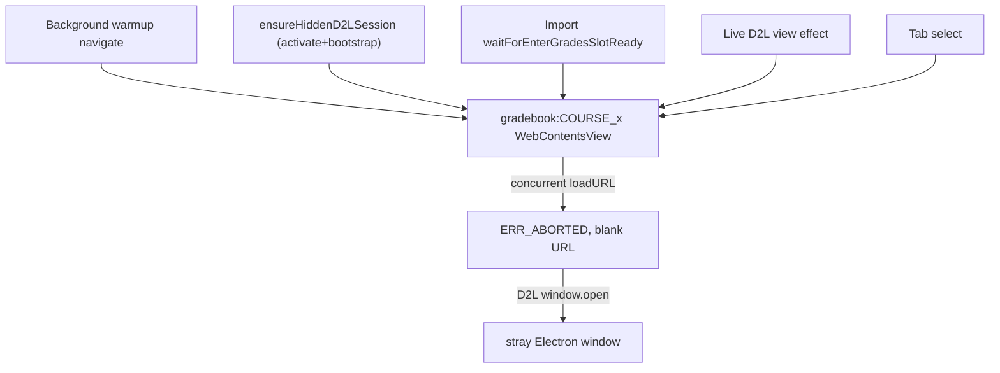

# Slot Orchestrator + Gradebook Loading Hotfix

Two new phases to insert into [macro_app_structural_consolidation_60b148c9.plan.md](c:\Users\chase\Documents\Programs\.cursor\plans\macro_app_structural_consolidation_60b148c9.plan.md), between Phase 3 and Phase 4. Phase 3.4 is the urgent regression repair; Phase 3.5 is the architectural fix you asked for (serialization + event-based readiness per slot, not a clock).

## Why this is needed (root cause)

Multiple callers issue `activate`/`navigate` to the *same* gradebook slot concurrently — background warmup, `ensureHiddenD2LSession`, the import wait path, the live-view effect, and tab-select. They abort each other's loads (`ERR_ABORTED (-3)`), leave slots on an empty URL, and (because nothing re-navigates an already-created slot) the slot sits blank forever. D2L then triggers a `window.open`, which the popup handler allows as a separate Electron window.

Two confirmed code-level faults from the last batch:
- The renderer `activateSlot` never forwards `force` to main ([useEmbeddedBrowser.ts](c:\Users\chase\Documents\Programs\School Scrips\Macro App\renderer\src\hooks\useEmbeddedBrowser.ts) lines ~170-174), and main only loads a bootstrap URL when the slot is blank (`needsBootstrap`, [browser-view-slots.js](c:\Users\chase\Documents\Programs\School Scrips\Macro App\electron-app\browser-view-slots.js) line ~452). So the rewritten `ensureHiddenD2LSession` (lines ~452-477) can no longer navigate an existing-but-wrong slot — that was previously done by the `navigateInSlot` fallback I removed.
- Hidden slots never emit readiness to the renderer (`emitNavStateForSlot` only fires when `visibleSlotId === slotId`, [browser-view-slots.js](c:\Users\chase\Documents\Programs\School Scrips\Macro App\electron-app\browser-view-slots.js) lines ~603-621), forcing 250ms polling in [enterGradesSlotService.ts](c:\Users\chase\Documents\Programs\School Scrips\Macro App\renderer\src\services\enterGradesSlotService.ts).

## Phase 3.4 - Repair gradebook slot loading (urgent, get to green)

Goal: gradebook course slots load reliably again; no stray window; imports either finish or fail fast (<= 30s). Establish "one navigator per slot" as the minimal, Phase-3.5-compatible fix.

- Single navigator: make `useBackgroundGradebookSlotLoader` the only thing that *navigates* gradebook course slots. Change `ensureHiddenD2LSession` ([useEmbeddedBrowser.ts](c:\Users\chase\Documents\Programs\School Scrips\Macro App\renderer\src\hooks\useEmbeddedBrowser.ts)) to attach-only: activate the slot hidden, and if it is not already at Enter Grades, call `navigateInSlot` once (the working renderer path) instead of relying on the non-forwarded `force`. No Python `navigate-enter-grades-courses` from this path.
- Import readiness: in [useGradebookImport.ts](c:\Users\chase\Documents\Programs\School Scrips\Macro App\renderer\src\hooks\useGradebookImport.ts), keep the 30s total fail-fast budget ([importTimeout.ts](c:\Users\chase\Documents\Programs\School Scrips\Macro App\renderer\src\utils\importTimeout.ts)) but ensure the readiness wait actually resolves: wait for warmup-idle, then poll the slot; only navigate (renderer) if still not ready. Remove the dead `force`/`pollOnly` ambiguity so there is exactly one navigation owner during import.
- Stray popup: in the slot popup handler ([browser-view-slots.js](c:\Users\chase\Documents\Programs\School Scrips\Macro App\electron-app\browser-view-slots.js) `wirePopupHandling`, lines ~365-393), deny (or redirect to the primary browser slot) `window.open` originating from hidden `gradebook:*` slots, so a mis-navigated slot can never spawn a separate window.
- Verify: `npm run build`; manual smoke - app launches, all 4 course slots reach "Enter Grades ready" in the warmup log, open Gradebook shows the grid, clear one grade and confirm import finishes or errors within 30s, and no second Electron window appears.

## Phase 3.5 - Per-slot serialization + event-based readiness (the real fix)

Goal: make the race structurally impossible by giving each slot a single owner of in-flight operations, and replacing polling with readiness promises driven by existing load events. Extends [slotOrchestrator.ts](c:\Users\chase\Documents\Programs\School Scrips\Macro App\renderer\src\services\slotOrchestrator.ts) - does NOT add a parallel system, and is explicitly not a global timing/clock manager.

- Per-slot operation queue: add a small serializer in `slotOrchestrator.ts` keyed by slotId so concurrent `showSlotAtUrl` / navigate / activate calls for the same slot run one-at-a-time (coalesce duplicate "go to same URL" requests). Callers keep their existing API; the queue is internal.
- Event-based readiness (replace the clock): emit a per-slot ready/load-stopped signal for hidden slots too. In [browser-view-slots.js](c:\Users\chase\Documents\Programs\School Scrips\Macro App\electron-app\browser-view-slots.js), broaden the `did-stop-loading`/`did-navigate` handlers (lines ~609-621) to emit a lightweight `browserView:slotReady` (slotId + url) regardless of visibility; expose `onSlotReady` in [preload.js](c:\Users\chase\Documents\Programs\School Scrips\Macro App\electron-app\preload.js) alongside the existing `onNavState`.
- Readiness promise: rewrite [enterGradesSlotService.ts](c:\Users\chase\Documents\Programs\School Scrips\Macro App\renderer\src\services\enterGradesSlotService.ts) `waitForEnterGradesSlotReady` to await the `onSlotReady` event for the target slot/OU (with the 12s/8s budgets as ceilings), removing the 250ms poll loop.
- Adopt one path: route background warmup, `ensureHiddenD2LSession`, import, the live-view effect, and tab-select through the orchestrator's per-slot queue so "one navigator per slot" is enforced by construction rather than convention.
- Verify: extend [slotOrchestrator.test.ts](c:\Users\chase\Documents\Programs\School Scrips\Macro App\renderer\src\services\slotOrchestrator.test.ts) with a serialization test (two concurrent requests to one slot run sequentially; duplicate-URL coalesces); build + the same manual smoke as 3.4 plus an Assignment Assistant tab switch to confirm no regression.

## Sequencing and scope

- Do 3.4 first (green), then 3.5. 3.5 makes 3.4's "single navigator" rule structural.
- Out of scope: the import/save Python logic itself (the save/verify post-feedback fix stays), UI redesigns, and the D2L-Assignment-Platform tree.
- After 3.5 lands, the per-render slot guards and the warmup-busy ref in [useMacroAppShell.ts](c:\Users\chase\Documents\Programs\School Scrips\Macro App\renderer\src\hooks\useMacroAppShell.ts) become removable (folds into Phase 4 god-file split).